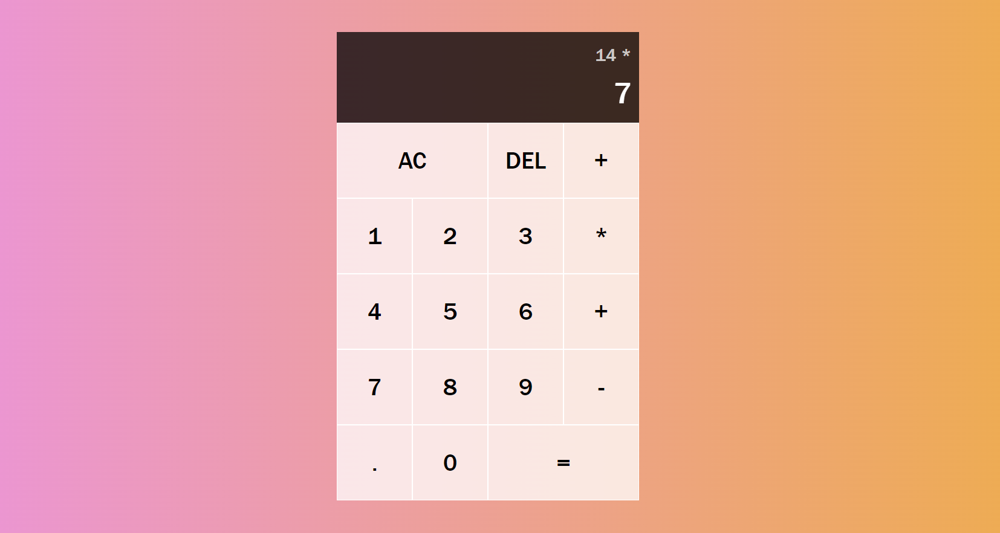

# Practice JS Vanilla Calculator 

### This is a simple calculator created in simple javascript. I followed this tutorial to help guide me: https://www.youtube.com/watch?v=j59qQ7YWLxw
### Try it out [here] (https://heparish.github.io/calculator-practice/)

## Screenshot

